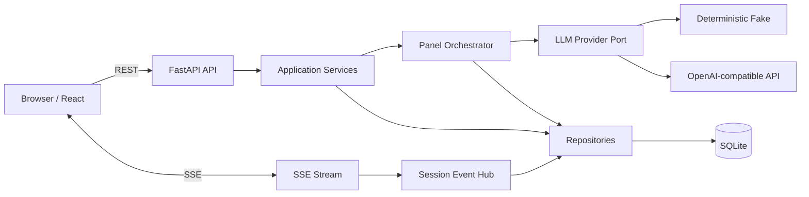
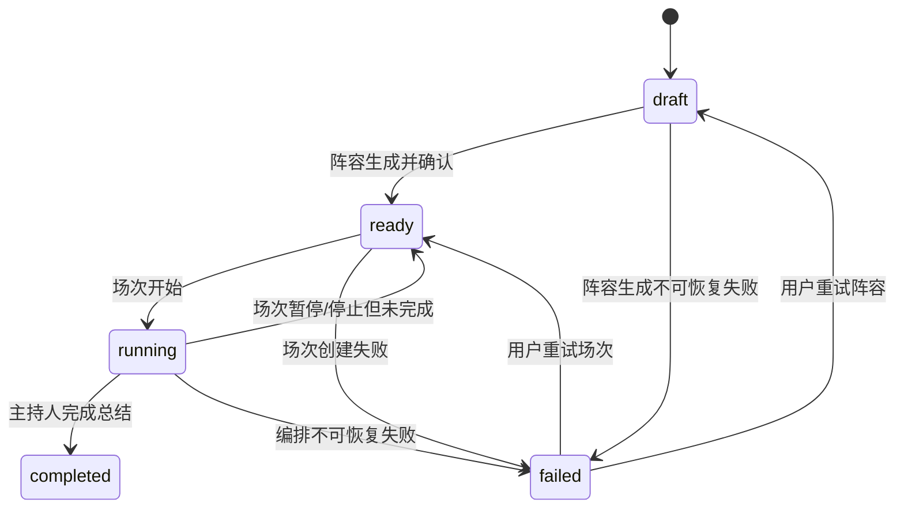
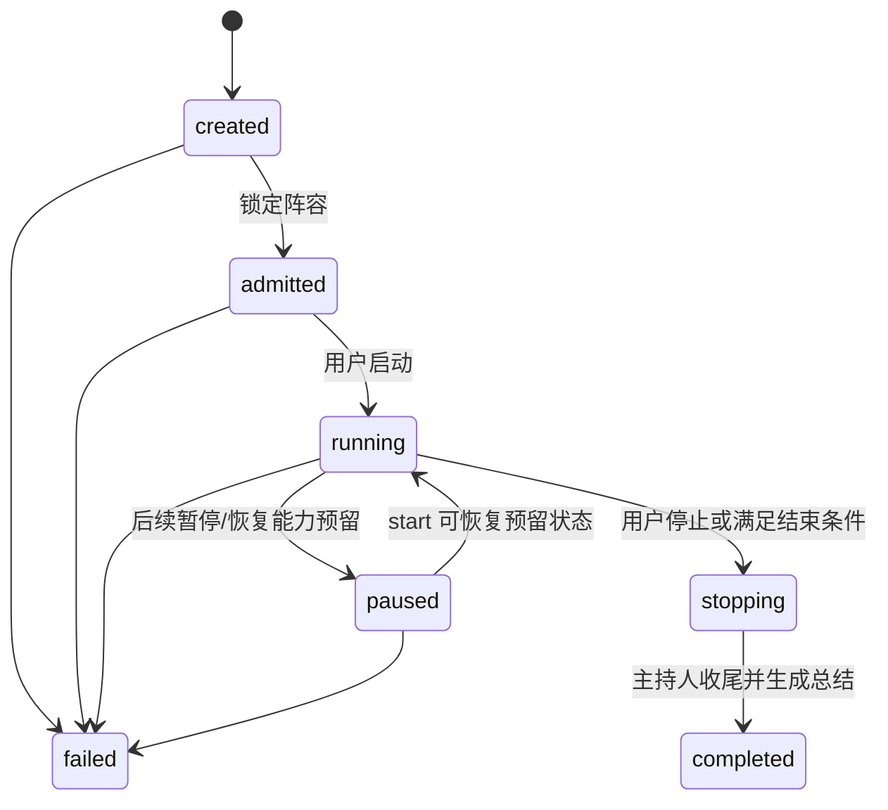
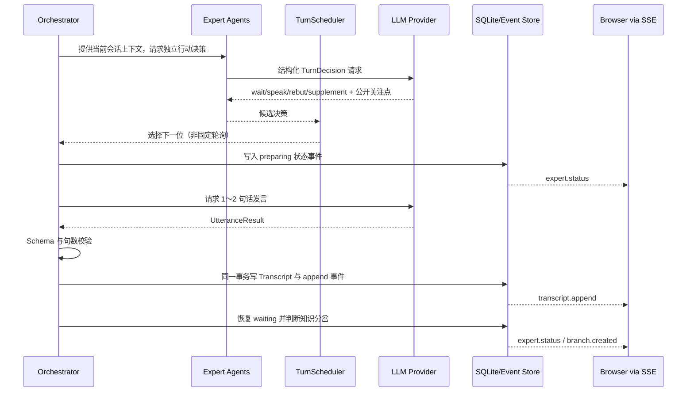

# AI Panel Studio 架构设计

## 1. 技术选择

- 前端：React、TypeScript、Vite。组件与状态模型明确，适合响应式单页应用。
- 后端：FastAPI、Pydantic、SQLAlchemy。适合显式 API 契约、异步 SSE 和严格模型校验。
- 数据库：SQLite。满足本地 MVP、可复现测试和低部署成本。
- 实时通道：SSE。讨论主要是服务端到浏览器的单向增量事件，协议简单且支持事件 ID。
- 测试：Pytest、Vitest、Playwright；真实模型通过 Provider 边界替换为 Fake/Mock。

## 2. 系统拓扑

REST 承担命令与快照读取；SSE 只承担指定 Session 的事件增量。数据库中的 `internal_events` 是断线恢复和审计的事实来源，内存 Event Hub 只用于低延迟通知。

## 3. 模块边界

### 前端

- `features/topics`：话题列表、创建、恢复。
- `features/panel`：阵容生成与确认。
- `features/studio`：Transcript、状态卡、分岔、总结与连接状态。
- `services/api`：REST Client。
- `services/events`：SSE 连接、重连、去重。
- `state`：以 topicId/sessionId 为 Key 的客户端状态，禁止使用单一全局 Transcript。

### 后端

- `domain`：实体、枚举、状态转换、调度规则。
- `schemas`：外部 API 与模型输出的 Pydantic Schema。
- `repositories`：持久化接口及 SQLite 实现。
- `services`：用例服务、事务边界、幂等策略。
- `orchestration`：主持人、专家代理、TurnScheduler、上下文预算。
- `llm`：Provider Port、真实适配器、Fake Provider、版本化 Prompt。
- `api`：REST/SSE、请求校验、错误映射。
- `events`：事件持久化、发布和按序回放。

## 4. 状态机

### Topic 状态

### PanelSession 状态

只有应用服务可以驱动状态转换；Repository 不包含业务转换逻辑。

## 5. 一次发言的事件流程

## 6. 会话隔离与并发

- 所有会话产物表都带 `session_id`；所有读取必须显式过滤。
- SSE Endpoint 同时校验 URL 的 `session_id` 与该 Session 所属 `topic_id`。
- 数据库对 `(session_id, sequence)` 建唯一约束，保证消息和事件顺序。
- 单个 Session 使用应用级锁串行写入可见发言；不同 Session 可并发运行。
- Event Hub 的订阅频道使用 `session:{uuid}`，禁止共享广播频道。
- 前端 Store 使用 `{topicId}/{sessionId}` 作为缓存键，切换时先关闭旧连接。

## 7. 上下文管理

每次模型调用只发送当前 Session 的上下文：主题、背景、已确认阵容、最近若干条 Transcript、滚动摘要和相关分岔。达到预算时将较旧发言压缩为内部上下文摘要，但不改写已保存 Transcript。不得把其他 Session 内容加入上下文。

## 8. 数据可见性边界

| 数据 | 持久化 | API/UI 可见 |
| --- | --- | --- |
| 发言正文、发言人公开资料 | 是 | 是 |
| waiting/preparing/speaking | 是 | 是 |
| 简短公开关注点 | 是 | 是 |
| TurnDecision action/urgency/target | 可作为内部事件 | 否 |
| Provider 原始响应 | 默认否 | 否 |
| 隐藏思维链 | 不请求、不保存 | 否 |
| 总结结构化中间结果 | 可内部保存 | 仅输出 naturalText |

## 9. 故障与恢复

- 模型非法输出：Schema 校验失败，有限修复重试；仍失败则产生安全错误事件并恢复专家状态。
- SSE 断开：事件先落库；客户端携带 Last-Event-ID 重连并补发。
- 重复请求：生成阵容、确认和启动接口支持幂等键或状态检查。
- 进程重启：MVP 不保证运行中的后台任务自动恢复；已持久化的 Transcript、分岔与已完成总结仍可读取。生产化需要启动时检查点与持久化任务队列。
- 总结失败：保留完整 Transcript；单独重试总结是后续计划，当前未暴露公开端点。

## 10. 安全边界

- 真实 Key 仅从后端进程环境读取。
- `.env`、SQLite 运行文件、日志和浏览器构建产物不得包含 Key。
- 错误响应使用稳定错误码，不返回堆栈、模型原始载荷或环境变量。
- 所有模型输出均视为不可信数据，先校验和限制长度再使用。
