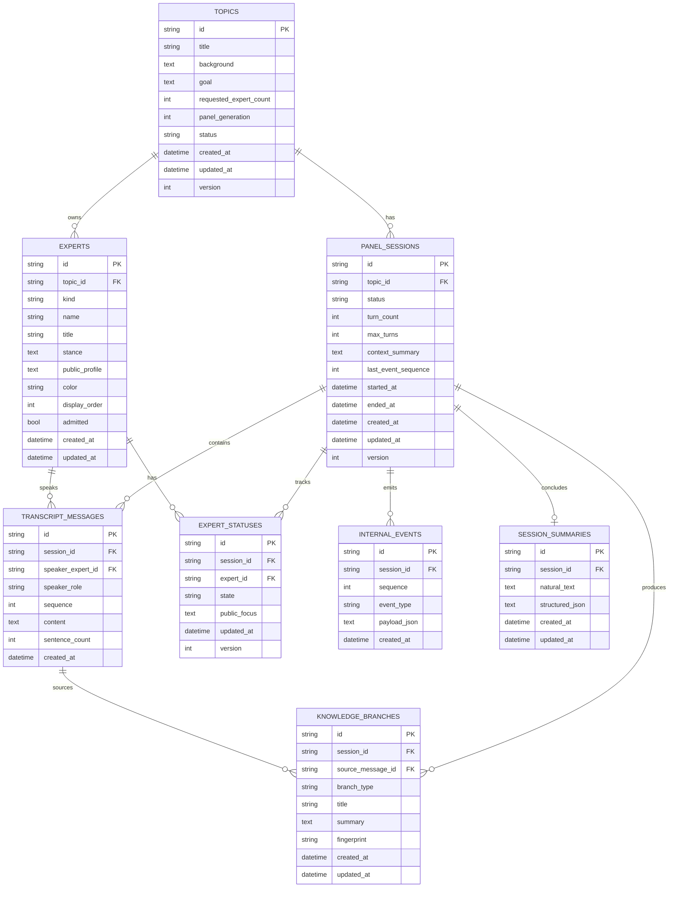

# AI Panel Studio 数据模型

## 1. 设计原则

- 主键使用 UUID 字符串，时间统一保存为 UTC ISO 时间或数据库 UTC DateTime。
- 所有会话产物显式携带 `session_id`，避免通过隐式“当前话题”查询。
- 枚举在应用层严格校验；数据库存储稳定小写值。
- JSON 只用于内部可变载荷（事件与结构化总结）；用户可见正文使用明确文本列。
- 每张可更新表包含 `created_at`、`updated_at`；需要并发保护的表包含 `version`。

## 2. ER 图

## 3. 表定义与约束

### topics

| 字段 | 约束/说明 |
| --- | --- |
| id | PK，UUID |
| title | 必填，1～200 字符 |
| background | 可空，最多 4000 字符 |
| goal | 可空，最多 2000 字符 |
| requested_expert_count | 2～8，默认 4 |
| panel_generation | 当前阵容版本，首次生成后为 1，每次重新生成递增 |
| status | draft/ready/running/completed/failed |
| version | 乐观锁，默认 1 |

索引：`updated_at DESC`、`status`。

### experts

`kind` 为 host 或 expert；同一 Topic 只能有一名 admitted host。颜色保存为受控十六进制字符串。阵容确认后不允许原地改变公开身份；重新生成应替换未确认阵容。

索引/约束：`(topic_id, display_order)` 唯一；`topic_id`；应用层保证单 host。

### panel_sessions

`status` 为 created/admitted/running/paused/stopping/completed/failed。`max_turns` 防止无限讨论，默认值由配置决定。`last_event_sequence` 在同一事务中递增，用于 SSE 顺序。

索引：`topic_id`、`status`、`updated_at DESC`。应用层保证一个 Topic 最多一个 running Session。

### transcript_messages

`speaker_role` 为 host/expert/system；MVP 的用户可见 Transcript 只返回 host/expert。`sequence` 是 Session 内严格递增序号。`sentence_count` 保存校验结果。

约束：`(session_id, sequence)` 唯一；正文非空且限制最大长度。

### expert_statuses

每个 Session × Expert 只有一行快照；`state` 为 waiting/preparing/speaking。`public_focus` 只允许简短公开摘要，不得保存隐藏推理。

约束：`(session_id, expert_id)` 唯一。

### knowledge_branches

`branch_type` 为 concept/assumption/conflict/question/direction。`fingerprint` 用于同一 Session 内去重。

约束：`(session_id, fingerprint)` 唯一；来源消息必须属于同一 Session。

### internal_events

事件追加写，不允许修改。`payload_json` 是经过 Schema 校验的内部载荷。API 在返回前按事件类型投影公开字段。

约束：`(session_id, sequence)` 唯一；索引用于 `sequence > lastEventId` 回放。

### session_summaries

每个 Session 最多一份总结。`natural_text` 是 API/UI 唯一允许直接展示的内容；`structured_json` 仅供内部检索与未来扩展。

约束：`session_id` 唯一。

## 4. 级联与删除

- 删除 Topic 时级联删除 Experts 和 Sessions；Session 再级联删除其状态、消息、分岔、事件和总结。
- UI 提供话题删除并要求二次确认；运行中、暂停中或正在收尾的场次受后端状态保护，不允许删除。
- 不使用把专家与 Session 之外数据隐式关联的全局 ID 查询。

## 5. 不变量

1. Session 的所有 ExpertStatus 必须引用该 Session 所属 Topic 的 admitted Experts。
2. Session 启动前必须存在一名 admitted host 和至少两名 admitted experts。
3. 可见 Transcript 序号与事件序号分别单调递增。
4. 同一 Session 同一时刻最多一个 ExpertStatus 为 speaking。
5. completed Session 必须有 ended_at；成功完成时应有 natural_text 总结。
6. 任何 API 都不能返回 `structured_json`、TurnDecision 内部字段或 Provider 原始响应。
